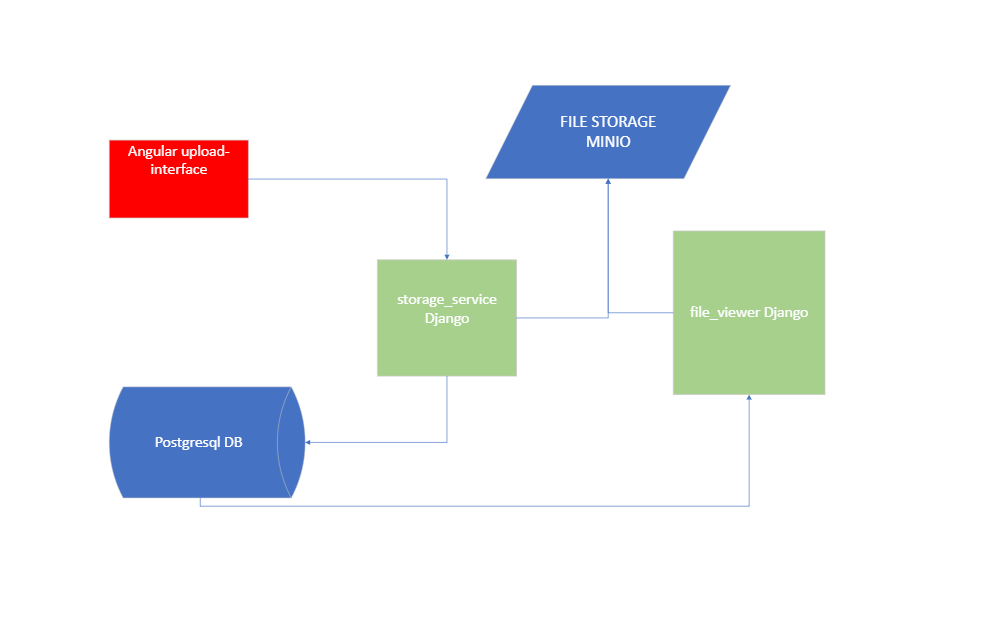

## Microservices - Docker and docker-compose for beginners

# Table of contents:
1) Goal of this tutorial
2) Instalation
3) Getting familiar with Docker and docker-compose.yml
4) Deployment
5) Extra work

# 1) Goal of this tutorial
   
The goal of this is to familiarize users with Docker and docker-compose, and understand the advantages they bring in development and deploying by using them with a small practical project. The tutorial is made both for Windows and Linux, so that everybody can give it a try. 

Using docker and docker-compose we will deploy 2 django services, 1 angular service, 1 database and one CDN with A SINGLE COMMAND!

The arhitecture looks like this:

## Knowledge prerequisites

- basic linux commands knowledge

- yml files

- recommended also basic deployment knowledge for python,angular,java or other language used in Luminess ; just for self-comparission purposes

# Before entering the tutorial, let's explain some key concepts:

## What is Docker?

Docker is a platform that enables developers to create, deploy, and run applications in lightweight, portable containers. \
These containers encapsulate everything an application needs to run—code, runtime, system tools, libraries—ensuring consistency across different environments. \
By using Docker, you can streamline development workflows, improve resource efficiency, and simplify the process of scaling applications, as the same containerized application can run seamlessly on any machine that has Docker installed.

**Long-story short, with Docker installed everybody can have the same working setup, eliminating classic problems like "it works on my machine". If it works on one Docker env, it works on all.**

## What is an image?

In the context of Docker, an image is a lightweight, standalone, and executable package that includes everything needed to run a piece of software, such as the application code, runtime, libraries, environment variables, and configuration files. \
Images are essentially the blueprint for containers; they are immutable, meaning once an image is built, it doesn't change. When you run a Docker container, it's created from an image, which ensures that the application behaves the same way regardless of where it’s deployed.

**Basically, an image represents all the code, dependencies, and configuration needed to run an application in a consistent and reproducible environment.**

## What is a container?

A container is a lightweight, isolated runtime environment that runs an application along with its dependencies, all packaged together in a Docker image. \
Containers provide a consistent environment for applications, ensuring that they run the same regardless of where they're deployed, whether on a developer's local machine, a server, or in the cloud. \
Unlike virtual machines, containers share the host system's kernel, making them more efficient in terms of resource usage and startup time.

**In other words, a container can be thought of as a running instance of an image. For example, if we have an image representing a Django backend service, we can create and run as many containers as we need from that single image**

## What is a volume?

A volume in Docker is a mechanism for persisting data generated by and used by containers. Unlike the data inside a container, which is ephemeral, volumes allow you to store data on the host machine, ensuring it persists across container restarts and even if the container is removed.

**When we spin up a docker container, by default it chooses a "random" folder on the host machine to store the data for that container. If we restart that container, all the data will be lost. This is very bad for containers like a postgresql database, so in order to have data persistence, we use a volume to define a specific folder in which the image will write the data.**

## What is a Dockerfile?

A Dockerfile is a script that contains a series of instructions on how to build a Docker image. It defines the base image, application code, dependencies, and configurations needed to create a custom image. Think of it as a recipe for creating your Docker image.

Now with the theory set, go to the [instalation](./docs/install.md) step.

[next_page](./docs/install.md) \
[home_page](./README.md)
