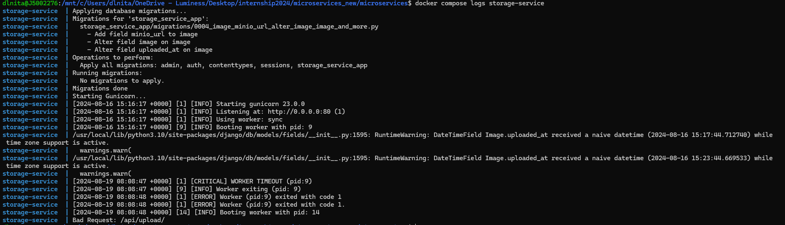

# 4) Deploy the system

Good work making it so far!

Let's deploy the system.

Open a command line/terminal and go to the root of the project.

After that, run this command:

```bash
docker compose up --build -d
```

With this simple command, all the services are up and running!
 
The --build flag tells docker-compose to build the images. If it's the first time it will take a while, on the next runs it will be fast and rebuild only the services with changes in them.

The -d flag runs in "detached" mode, not "blocking" the terminal. Try to run without it to see the full effect. 


We can check the availability of the services using:
```bash
docker ps
```

Example:


And we can also check the logs for each of the services using
```bash
docker compose logs <service_name>
```

Example:


You can kill the whole system using:

```bash
docker compose down
```

**Congratulations, you have deployed the system on your computer using Docker and docker-compose!**

**The theory part of the tutorial is done, but to fully understand docker-compose go on the next page and finish the assingment!**

[next_page](./ASSIGNMENT.md) \
[home_page](../README.md)