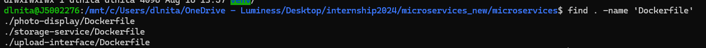

3) # Getting familiar with Docker and docker-compose


## Dockerfiles

In this section we will take a dive into Dockerfiles and their role. \
As explained in the first part, we are going to deploy a few services, two django services, one angular service and some others.

Let's first get familiar with our project, by running a command to see the files.


We can see a lot of files and folders, but four specifically concern us:

- docker-compose.yml
- photo-display/
- storage-service/
- upload-interface/

Let's take a little dive into the folders:
1) upload-interface is an Angular app that allows us to upload images. it's the entrypoint in our system.
2) storage-service is a Django app that stores images in the database and in a S3 bucket.
3) photo-display is also a Django app that will display images on the screen.

If we take a look into each folder, we can see that each of these apps has a Dockerfile:



Each Angular and Django app has a Dockerfile, because we need to configure the coresponding images that they will be running on.

These Dockerfiles contain basic commands for configuring these images, such as basic linux commands, and in our case classic Python and Node commands. (pip, manage.py, npm, etc). Let's explain one of the images, for example the one from the **storage_service**.

```Dockerfile
FROM python:3.10

ENV PYTHONDONTWRITEBYTECODE 1
ENV PYTHONUNBUFFERED 1


WORKDIR /app

COPY . /app

RUN pip install -e .

RUN mkdir -p /app/media

COPY entrypoint.sh /app/entrypoint.sh
RUN chmod +x /app/entrypoint.sh

ENTRYPOINT ["/app/entrypoint.sh"]

EXPOSE 80

CMD ["gunicorn", "storage_service.wsgi:application", "--bind", "0.0.0.0:80"]
```

- The "FROM" command will specify the exact image distro. FROM python3.10 means we will use a linux with python3.10 preinstalled and no much else. Small or stripped down distros are also classified sometimes as "alpine". We can also use Windows or even OSX (MacOS) images.

- The "ENV" keyword will help us set envinroment variables.

- WORKDIR /app defines the path where our application will do it's things. So in our case, at the /app/ path, we will have our applicaiton.

- COPY . /app will copy the contains of our folder on the host machine (in our case the python files, setup.py, etc) at the /app path of the container.

- RUN will allow us to run linux commands, such as pip install -e . (specific for python to install dependencies when setup.py is present in the location) or to create a directory.

- ENTRYPOINT ["/app/entrypoint.sh"]: The ENTRYPOINT command sets the main command that will run when a container starts. In this case, it specifies that the script located at /app/entrypoint.sh should be executed as the container's entry point. This script often sets up the environment, runs necessary startup tasks, or prepares the application before it starts.

- EXPOSE 80: The EXPOSE command indicates that the container will listen on the specified network port at runtime. Here, port 80 is exposed, which is the default port for HTTP traffic. This doesn’t actually publish the port to the host machine; it just informs Docker and other developers that the service inside the container will be available on this port. In the docker-compose section we will see how to publish the port on the host machine. 

- CMD ["gunicorn", "storage_service.wsgi
", "--bind", "0.0.0.0:80"]: The CMD command provides the default command and arguments to run within the container when it starts. In this example, it specifies that the gunicorn web server should start the Django application (storage_service.wsgi:application) and bind it to all network interfaces on port 80. If an ENTRYPOINT is defined, CMD provides additional arguments to it unless overridden at runtime.


These were the most important commands in working with Dockerfiles, with these commands we can start building images, but, for learning purposes let's take a look at the Angular project's Dockerfile and try to figure out what happens in the resulting image. Do this exercise for yourself:

```Dockerfile

#MEDIUM: WHAT TYPE OF DISTRO IS USED?
FROM node:latest as build

#EASY: WHAT DOES THIS COMMAND DO?
WORKDIR /usr/local/app

COPY ./ /usr/local/app/

RUN npm install

RUN npm run build

#HARD:  WHAT HAPPENS HERE? WHY ARE THERE TWO IMAGES?
FROM nginx:latest

COPY --from=build /usr/local/app/dist/upload-interface /usr/share/nginx/html

EXPOSE 80
```


## Docker-compose

Now that we have looked into Dockerfiles, we understand that we have configured 3 images, one for each of the 3 services (2 Django 1 Angular). \
**How will these services talk to each other? On what ports will they run? Are there any prerequisites for them (i.e. database)?** This is where docker-compose comes into play

### What is docker-compose?

Docker Compose is a tool that simplifies the process of defining and running multi-container Docker applications. With a simple YAML file, you can define your services, networks, and volumes, and then use a single command to start everything up, making it easier to manage complex applications.

**Basically, docker-compose orchestrates our containers, defining their prerequisites and the communication between them.**

In docker-compose, each application in our system is defined as a service. So, each service represents one component of the application, like a database, web server, or backend service.

Let's take a look into a simple docker-compose.yml file and explain each line. This docker-compose file will manage a Django app and a postgresql database.\
The file is in the .yml / .yaml format. You can read more about the format [here](https://www.cloudbees.com/blog/yaml-tutorial-everything-you-need-get-started)

```Dockerfile
services:
    storage-service:
        build:
            context: ./storage-service  
            dockerfile: Dockerfile      
        container_name: storage-service
        ports:
        - "8000:80" # host port | container port
        depends_on:
        - db
        environment:
        - DATABASE_URL=postgres://user:password@db:5432/app1_db
    db:
        image: postgres:13-alpine
        container_name: postgres-db
        environment:
        - POSTGRES_USER=user
        - POSTGRES_PASSWORD=password
        - POSTGRES_DB=app1_db
        
        volumes:
        - postgres-data:/var/lib/postgresql/data
        ports:
        - "5432:5432"
volumes:
  postgres-data:

```


### 1. `storage-service`
- **build**:
  - `context: ./storage-service`: Specifies the build context, which is the directory containing the files needed to build the Docker image. Here, it points to the `./storage-service` directory.
  - `dockerfile: Dockerfile`: Indicates the Dockerfile to use when building the image. By default, Docker looks for a file named `Dockerfile` in the context directory, but this is explicitly stated here.
- **container_name**: Sets the name of the container to `storage-service`, which makes it easier to reference and manage.
- **ports**:
  - `8000:80`: Maps port 80 inside the container (where the application listens, as defined by the `EXPOSE 80` command in the Dockerfile) to port 8000 on the host machine. This allows you to access the service on `http://localhost:8000`.
- **depends_on**:
  - `db`: Specifies that the `storage-service` depends on the `db` service, ensuring that the database container is started before the `storage-service`.
- **environment**:
  - `DATABASE_URL=postgres://user:password@db:5432/app1_db`: Sets an environment variable inside the container, which is typically used by the application to connect to the database. Here, it defines the connection string for a PostgreSQL database running on the `db` service.

### 2. `db`
- **image**:
  - `postgres:13-alpine`: Specifies the Docker image to use for the `db` service. This image is based on PostgreSQL version 13 and is built using the lightweight Alpine Linux distribution.
- **container_name**: Sets the name of the container to `postgres-db`.
- **environment**:
  - `POSTGRES_USER=user`: Sets the database user to `user`.
  - `POSTGRES_PASSWORD=password`: Sets the password for the database user to `password`.
  - `POSTGRES_DB=app1_db`: Sets the name of the database to `app1_db`.
- **volumes**:
  - `postgres-data:/var/lib/postgresql/data`: Mounts a Docker volume named `postgres-data` to the PostgreSQL data directory inside the container. This ensures that the database data persists even if the container is removed.
- **ports**:
  - `5432:5432`: Maps port 5432 inside the container (the default PostgreSQL port) to port 5432 on the host machine, allowing you to connect to the database from the host.

## Volumes

- **postgres-data**: Defines a named volume that will be used to persist the PostgreSQL data. This volume ensures that the database data is not lost when the container is stopped or removed.


Some files might begin with "VERSION \<number> " but it's obsolete as of August 2024.

Now with this docker-compose file explained, look at the docker-compose.yml file in the root of this project and try to understand what it does. Than proceed to the next step:

[next_page](./DEPLOYMENT.md) \
[home_page](../README.md)
