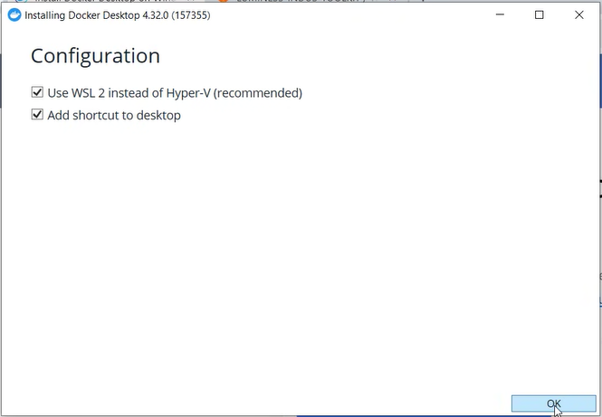
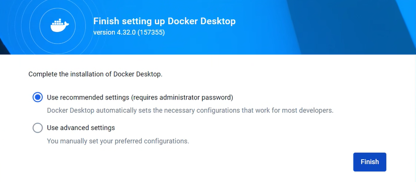
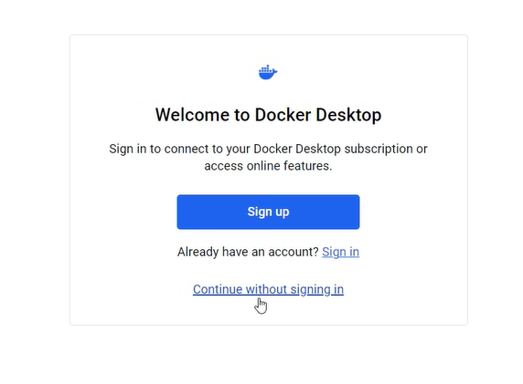
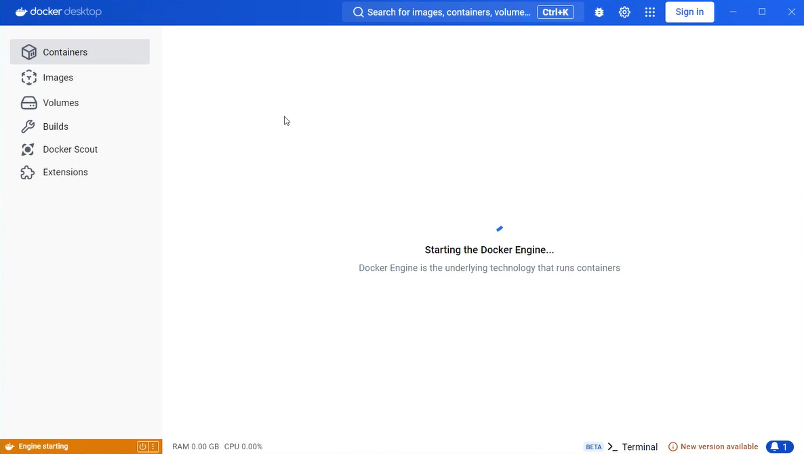

# 2) Instalation

## In this section we will install Docker engine


Install Docker and Docker Compose:

Go to this link and download the version for your specific OS and CPU Arhitecture:\
[Get Docker](https://docs.docker.com/get-docker/)

Run the executable, and start the instalation.

If you are using Windows, install it using WSL2:



The instalation will take a few minutes, at the end proceed with the recommended settings:



After that, accept the Docker agreement and for this project, we can continue without a Docker account:





The docker instalation is at the end, the Docker Engine should be starting in a few seconds:\



**With this way of installing Docker, docker-compose is also installed, so our installation of the tools step is done!**

Verificy the installation by running the following commands in a cmd/terminal:

```bash
docker
docker compose
```

Each command should give you an output, and not an error. Contact the author of the course in case of an error at dlnita@luminess.eu

# 2.1) Cloning the project

Clone the project and "cd" into it:
```bash
git clone https://git.luminess.eu/luminess-indus-toolkit/training/internship2024/microservices-course/microservices.git

cd microservices/
```

The setup is done, we are now ready for the next steps in the tutorial.

[next_page](./DOCKERFILES.md) \
[home_page](../README.md)
